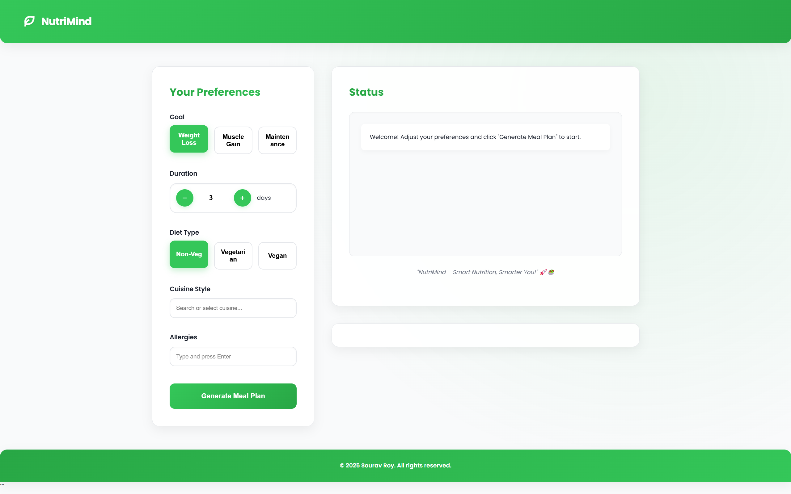
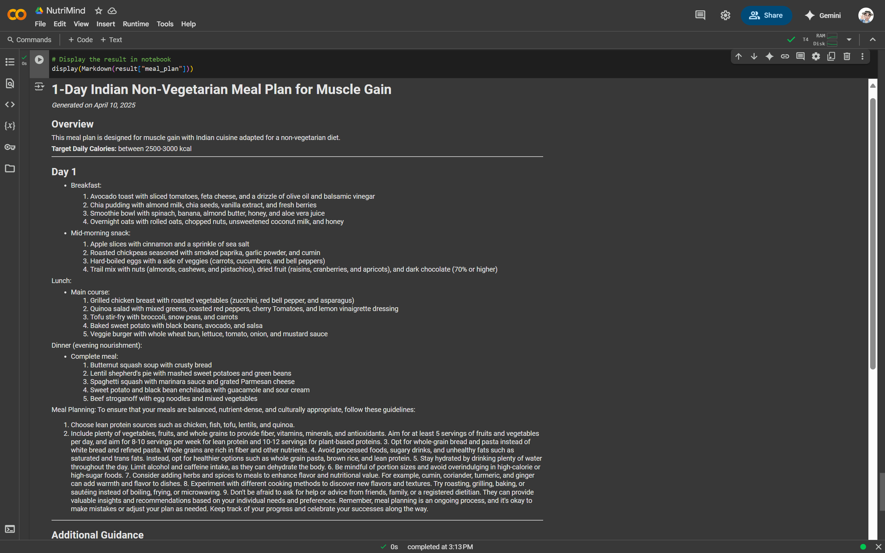

# NutriMind

NutriMind is an intelligent health and nutrition management application designed to empower users to take control of their dietary habits. With features such as personalized meal planning, progress visualization, and nutritional tracking, NutriMind is your go-to solution for a healthier lifestyle.

---

## Table of Contents

- [Features](#features)
- [Screenshots](#screenshots)
- [Architecture](#architecture)
- [Installation](#installation)
  - [Backend Setup](#backend-setup)
  - [Frontend Setup](#frontend-setup)
- [Usage](#usage)
- [Directory Structure](#directory-structure)
- [Contributing](#contributing)
- [License](#license)
- [Contact](#contact)

---

## Features

- **Daily Nutrition Tracking:** Log meals, snacks, and drinks to gain insights into your nutritional intake.
- **Personalized Meal Plans:** Generate meal plans tailored to your dietary preferences and health goals.
- **Progress Visualization:** View interactive charts and reports to monitor your progress over time.
- **Goal Setting:** Define and track your health objectives effectively.
- **Interactive Web Interface:** Simple and intuitive interface for seamless user interaction.
- **Backend API:** Robust FastAPI-based backend for managing user data and processing requests.

---

## Screenshots

### User Interface


### Generated Meal Plan Output


---

## Architecture

NutriMind is structured into two primary components:

### 1. **Backend**
The backend is built using Python and FastAPI. It includes:
- `server.py`: The main server file to handle API requests.
- `model/`: Directory containing data models and logic for managing user data.
- `requirements.txt`: Lists dependencies for the backend.

### 2. **Frontend**
The frontend consists of HTML, CSS, and JavaScript files to deliver a responsive and user-friendly interface. It includes:
- `index.html`: The entry point for the web application.
- Additional assets like styles and scripts for rich user interactions.

---

## Installation

### Backend Setup

1. Navigate to the `backend` directory:
   ```bash
   cd backend
   ```

2. Install dependencies:
   ```bash
   pip install -r requirements.txt
   ```

3. Start the server:
   ```bash
   python server.py
   ```

### Frontend Setup

1. Navigate to the `frontend` directory:
   ```bash
   cd frontend
   ```

2. Open `index.html` in your browser to launch the application.

---

## Usage

1. Open the web application at `http://localhost:8000` or the specified backend URL.
2. Create an account or log in to access features.
3. Start logging meals, setting goals, and viewing progress.

---

## Directory Structure

Here is an overview of the NutriMind repository:

```
NutriMind/
├── backend/
│   ├── model/          # Data model definitions
│   ├── server.py       # FastAPI server configuration
│   ├── requirements.txt # Python dependencies
├── frontend/
│   ├── index.html      # Main HTML file for the web app
│   ├── assets/         # Images, styles, and other assets
├── assets/
│   ├── ui.png          # Screenshot of the User Interface
│   ├── output.png      # Screenshot of the generated meal plan
├── LICENSE             # License for the project
├── Readme.md           # Project documentation
```

---

## Contributing

Contributions are welcome! Follow these steps to contribute:

1. Fork the repository.
2. Create a new branch:
   ```bash
   git checkout -b feature-name
   ```
3. Commit your changes:
   ```bash
   git commit -m "Add feature-name"
   ```
4. Push to your branch:
   ```bash
   git push origin feature-name
   ```
5. Open a pull request.

---

## License

This project is licensed under the MIT License. See the [LICENSE](LICENSE) file for details.

---

## Contact

For questions or feedback, feel free to reach out to [heysouravroy](https://github.com/heysouravroy).
